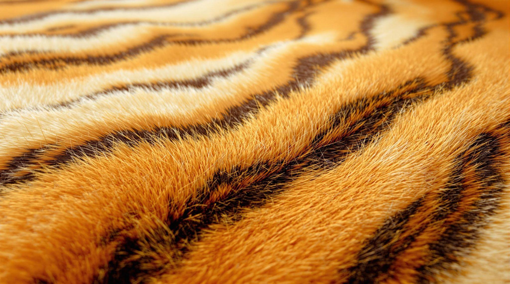
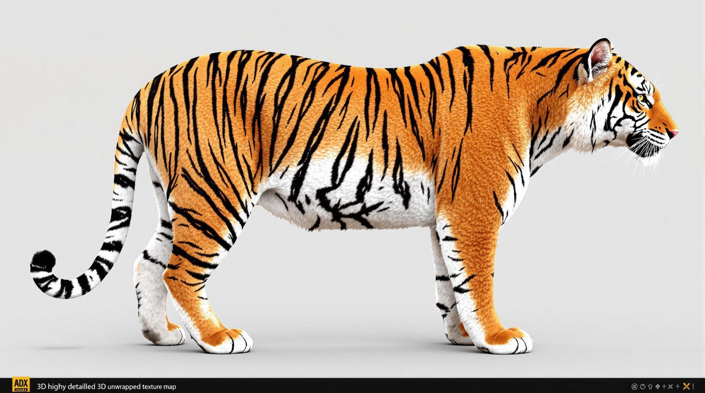
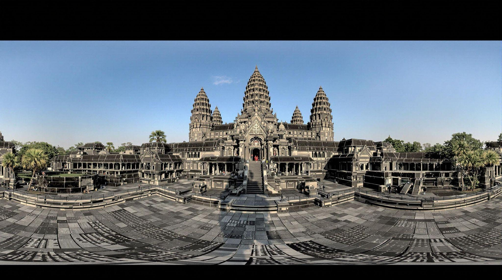
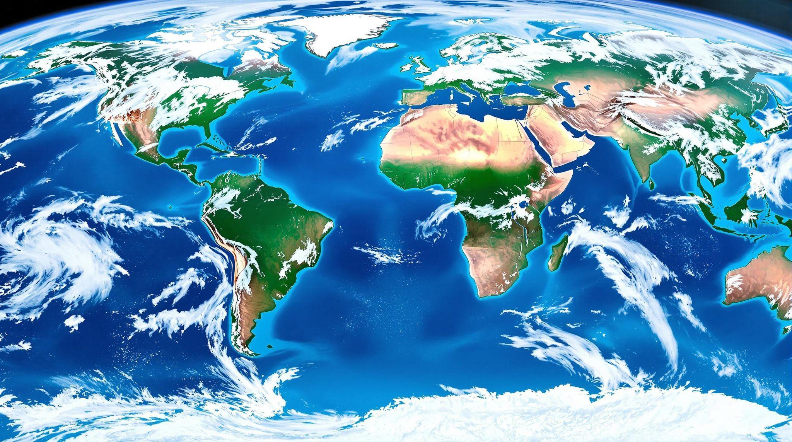
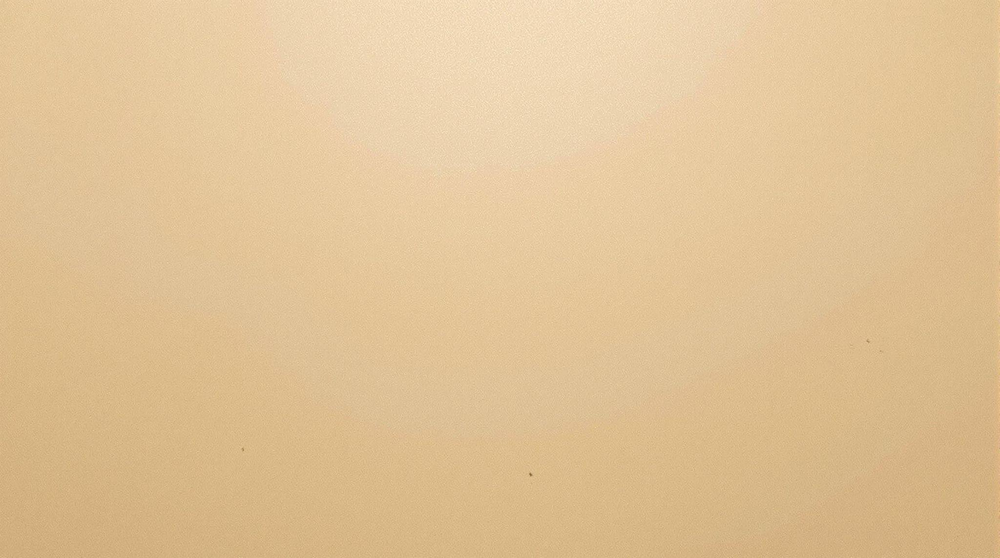
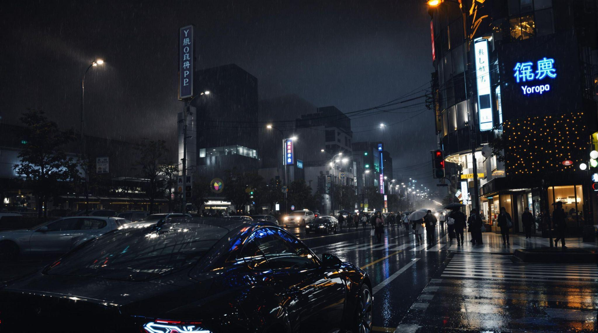
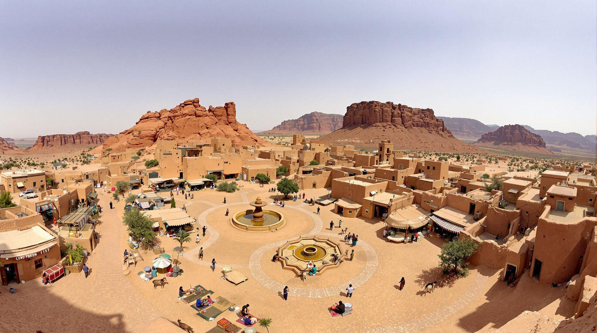
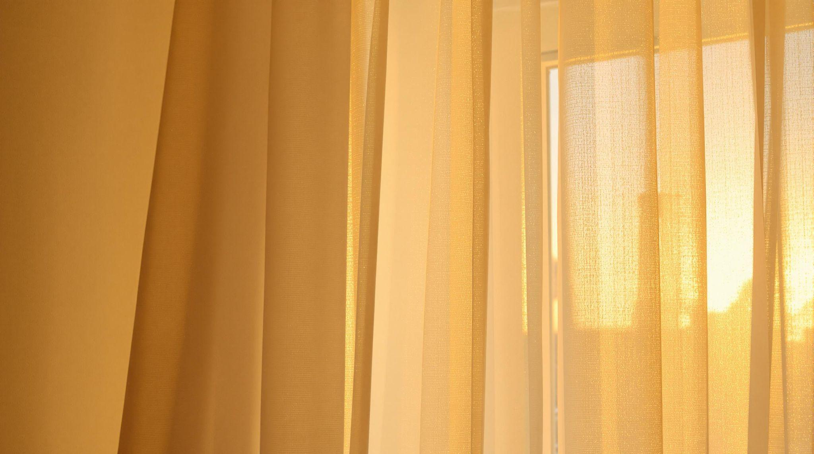
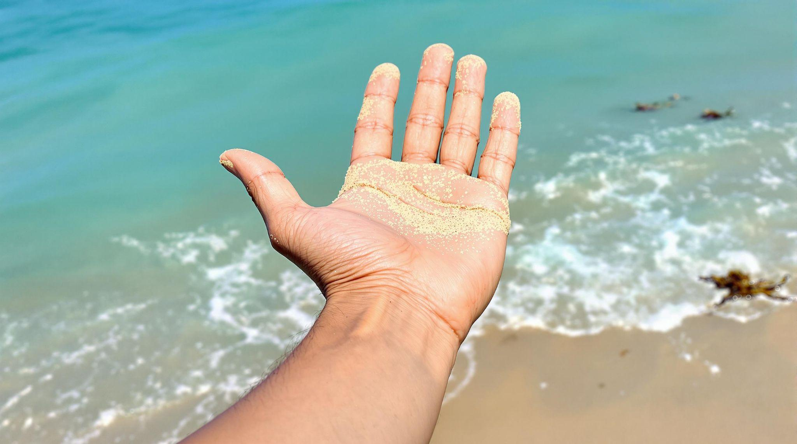
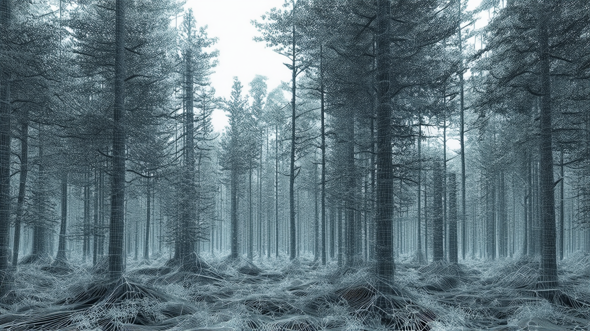

### Theory

### Texturing in VR Production: Bringing Virtual Worlds to Life
When you step into a virtual reality (VR) environment, what makes it feel real or immersive? It’s not just the 3D models or lighting—it’s the textures that bring surfaces to life. Texturing involves applying detailed 2D images to 3D models to create realistic or stylized surfaces. Whether you’re exploring an ancient temple in a VR game, interacting with a futuristic control panel, or walking through a virtual museum, textures define how objects look and feel.

### What is Texturing and Why Does it Matter?
Think of texturing as the difference between a blank, featureless 3D object and one that looks like weathered stone, polished wood, or shiny metal. Without textures, everything in a VR environment would appear as a smooth, colorless shape. Texturing adds details like scratches on metal armor, cracks on an old brick wall, or fingerprints on a glass surface, making virtual objects feel tangible.

For example, in a VR archaeology experience, textures can help recreate ancient ruins with weathered surfaces and moss growing in the cracks. In a racing game, texturing is what makes the asphalt look rough and the car's paint job gleam under the sun. Whether the goal is photorealism or a unique artistic style, texturing shapes how users perceive the virtual world.

**Img. 1:** Tiger skin textures

**Img. 2:** Archeological Architecture

### How Textures Work: Mapping 2D Images onto 3D Models
Textures are applied to 3D models using UV mapping, a process that unfolds the 3D surface into a flat 2D space—just like unwrapping a gift box. This ensures that textures align properly on objects. For more complex surfaces, techniques like projection mapping allow textures to be wrapped onto curved or irregular shapes without distortion.

Imagine a VR globe application where satellite imagery is applied to a sphere. Without proper UV mapping, continents might appear stretched or misaligned. A skilled texturing artist ensures that everything fits naturally, making the world look accurate and immersive.

**Img. 3:** Mapping 2D Images on 3D Models

### Different Types of Textures and Their Roles
Not all textures serve the same purpose. Some define an object’s color, while others control how light interacts with it. Here are key types of textures used in VR:

- **Diffuse Maps:** The base color of an object. For example, in a VR kitchen, the wood texture on cabinets or the marble pattern on countertops comes from diffuse maps.

    
    

- **Specular/Glossiness Maps:** Define how shiny or reflective a surface is. A wet road in a VR city would have high glossiness, while a chalkboard would appear matte.

    
    

- **Normal Maps:** Fake small surface details without adding complexity. For example, a brick wall in VR might look bumpy, but in reality, the surface is still flat.

    
    

- **Bump Maps:** Similar to normal maps but less detailed, great for adding subtle texture to fabrics or painted surfaces.

    
    

- **Displacement Maps:** Physically alters the 3D model’s surface based on texture data. If you want a cracked desert floor that actually has depth, displacement mapping is key.

    

- **Ambient Occlusion Maps:** Simulate realistic shadows in crevices. In a VR haunted house, these maps make dark corners feel more atmospheric.
- **Emissive Maps:** Make objects appear to glow. This is how neon signs in cyberpunk VR cities or buttons on a spaceship’s control panel get their self-lit appearance.

Each of these texture types works together to create objects that feel visually convincing and immersive.

### Texture Resolution: Balancing Quality and Performance
VR requires a delicate balance between visual detail and performance. High-resolution textures make objects look incredibly sharp, but they demand more computing power. If textures aren’t optimized, VR experiences can suffer from lag or lower frame rates, which can break immersion.

For example, a VR medical training simulator might require high-resolution textures to display skin textures, surgical instruments, and anatomical details accurately. However, in a VR open-world adventure, distant mountains or background buildings can use lower-resolution textures to save processing power.

**Img. 4:** Low & High Resolution Image

To optimize performance, developers often use texture compression and techniques like Level of Detail (LOD), which swaps out high-res textures for lower-res versions when objects are far away.

**Img. 5:** Interiors of Conference Room

### Realism vs. Stylization: Choosing the Right Texturing Approach
Some VR experiences aim for photorealism, while others go for a more stylized or artistic look. The choice depends on the project’s goals.

For example, architectural visualization in VR benefits from photorealistic textures—accurate wood grains, realistic reflections on glass, and finely detailed tile patterns help clients visualize real-world spaces. On the other hand, a fantasy VR game might use hand-painted textures, where objects have exaggerated colors and soft shading, giving the world a unique charm.

**Img. 6:** Forest Scene

A great example of stylized texturing is in games like *The Legend of Zelda: Breath of the Wild*, where textures are painted in a way that resembles concept art. In VR, this technique can create breathtaking environments without overwhelming the hardware.

### PBR Workflow: Making Textures React to Light Realistically
Modern VR production uses Physically Based Rendering (PBR) to make surfaces behave like real materials under different lighting conditions. PBR relies on multiple maps working together:
- **Base Color Map:** The main color of the object.
- **Metallic Map:** Defines metal vs. non-metal surfaces.
- **Roughness Map:** Determines if a surface is smooth (like glass) or rough (like concrete).
- **Normal Map:** Adds fine details like scratches or fabric weaves.

PBR ensures that in a VR sci-fi setting, metal doors shine under neon lights, while a wooden desk absorbs light naturally, making everything look more believable.

### Procedural Texturing: Infinite Detail Without Huge Files
Instead of using static images, procedural texturing generates textures dynamically using algorithms. This method is perfect for massive VR landscapes, like forests, planets, or oceans, where hand-painting textures for every surface would be impractical.

For example, in a VR space exploration game, procedural texturing can generate unique planets with different rock formations and colors, ensuring no two worlds look alike.

### Texture Baking: Precomputed Lighting for Better Performance
To optimize performance, VR developers use texture baking, which precomputes lighting, shadows, and details into the textures themselves. This reduces the need for real-time calculations, keeping VR smooth and responsive. For instance, in a VR horror game, the eerie glow of a flickering candle and the deep shadows in a haunted mansion can be baked into textures, maintaining the spooky atmosphere without slowing down the game.

### Popular Tools for VR Texturing
Artists use various tools to create and refine textures:
- **Substance Painter:** Advanced texture painting with PBR support.
- **Photoshop:** Great for creating and editing texture maps.
- **Blender:** Open-source software with UV mapping and texturing tools.
- **Quixel Mixer:** Ideal for creating realistic and procedural textures.

Each tool helps designers bring VR worlds to life with stunning detail.

### The Art and Science of VR Texturing
Texturing in VR is both a technical process and an art form. It’s what makes a velvet couch look soft, a rusty pipe feel aged, or a neon-lit cityscape feel alive. By mastering texturing techniques, VR creators can transport users into breathtakingly immersive experiences. Next time you step into a VR world, take a closer look at the surfaces around you. Every scratch, shadow, and reflection is carefully crafted to make you feel like you're truly there.
